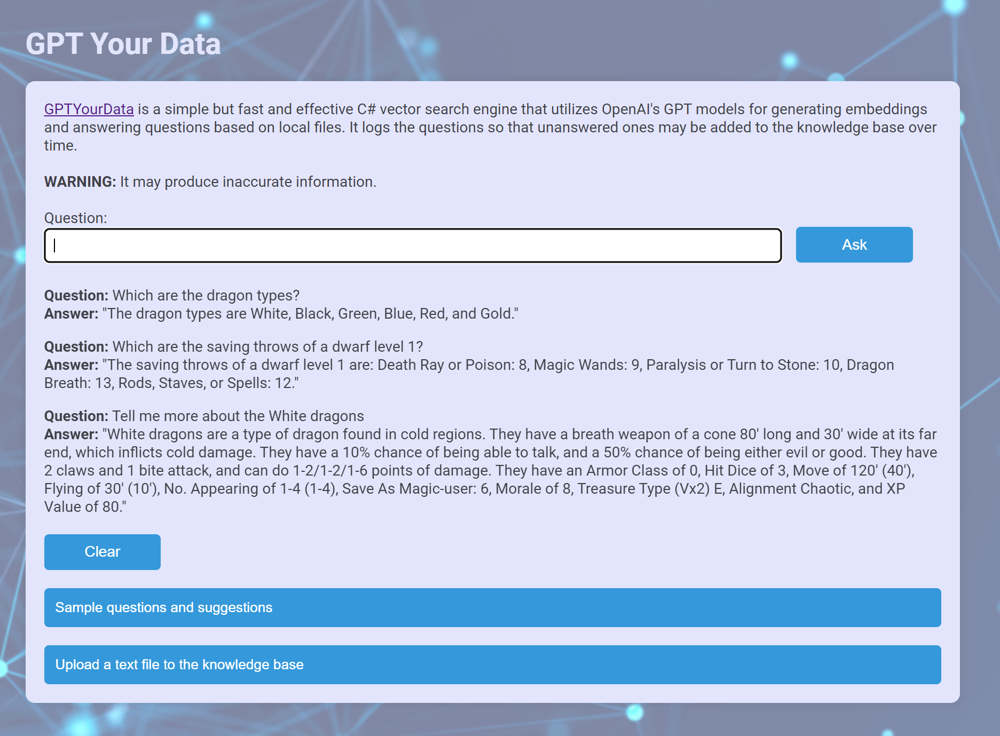

# GPTYourData
Welcome to GPTYourData! This project is a simple but fast and effective C# vector search engine that utilizes OpenAI's GPT models for generating embeddings and answering questions based on local files. It works with command line apps and also an alternative web page for asking questions and even easily uploading new files to extend the knowledge base.

## Getting Started
### Prerequisites
* [.NET 7](https://dotnet.microsoft.com/en-us/download/dotnet/7.0)
* An active [OpenAI API Key](https://platform.openai.com/account/api-keys)

### Installation
Download and extract the release -or build the solution from the sources. 
Insert your OpenAI API key (and organization if relevant) into the '.openai' file in the root of the project.

### Usage
Here's how to use GPTYourData:

**To generate your vector search local database:**
* Put all the text or PDF files you want to query in the Inputs folder.
* If you have any PDF files you want to query, use the **pdf2txt** utility provided in the project to convert them to text files. The tool will read and write them in the 'Inputs' folder.
* Use the **Embed** tool to read all txt files from the 'Inputs' folder and create embeddings for them in the 'Embeddings' folder. This only needs to be done once. Afterwards, the files will be moved to the InputDone folder. Alternatively, the web interface can be used to upload files easily as it will run Embed for you. 

**To query via command line app:**
Use the **Query** tool to ask questions using the embeddings generated previously. The tool will return the most relevant answers based on those embeddings.

**To query via web page:**
Launch the **QueryWeb** app and navigate in your browser to **localhost:5000**. If you want to use it externally, you can run it with "dotnet QueryWeb.dll --urls "http://youripaddresshere:5000""

Enjoy the power of AI-driven search on your local files!

## License
This project is licensed under the MIT License. See the LICENSE file for more details.
